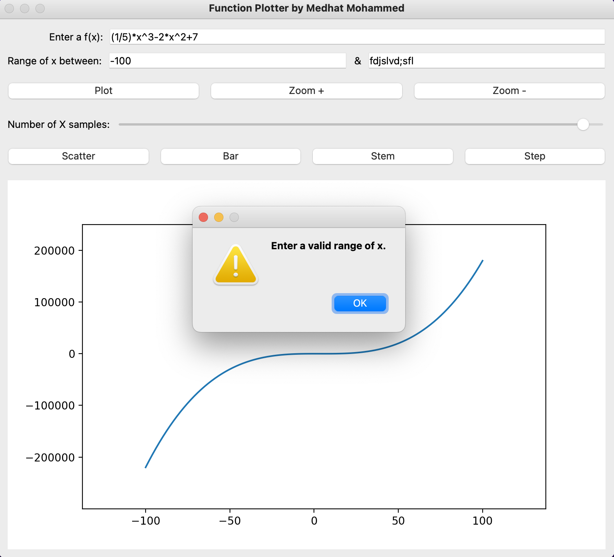

# Function Plotter

[](https://opensource.org/licenses/MIT)
[](https://www.python.org/downloads/)
[](https://pypi.org/project/PySide6/)
[](https://matplotlib.org/stable/users/installing/index.html)

[](https://travis-ci.org/github/standard-librarian/Function-Plotter/)
[](https://coveralls.io/github/standard-librarian/Function-Plotter?branch=main)

> Function Plotter is a GUI application built with PySide6 and Matplotlib for plotting 2D and 3D functions.
>  It provides a user-friendly interface to visualize functions in various plot types, including normal plots, bar plots, step plots, and stem plots.
> The application also supports zooming in and out to analyze functions in detail.


---

## Installation

```bash
# Clone the repository
git clone https://github.com/your-username/function-plotter.git

# Install dependencies
pip install -r requirements.txt

# Run the application
python main.py
```
## Features
- Plot 2D functions in various plot types: normal plot, bar plot, step plot, and stem plot, with adjustable x range.
- Five plotting modes
  - line plot
  - scatter
  - bar
  - stem
  - step 
- Zoom in and out to analyze functions in detail.
- Choose the number of samples to be plotted per time

## Videos

https://github.com/standard-librarian/Function-Plotter/assets/68431349/46c11cfc-eeee-4024-adc2-122a6f1a7fdc

## Screenshots




## Contributing

we welcome any contributions. If you have any ideas or suggestions for new features, feel free to submit a pull request or open an issue on the Github repository.

## Testing

Testing is essential to ensure the correctness and stability of your function plotter application. You can use the following command to run the tests:

```bash
pytest
```

## License

This project is licensed under the [MIT License](LICENSE).

